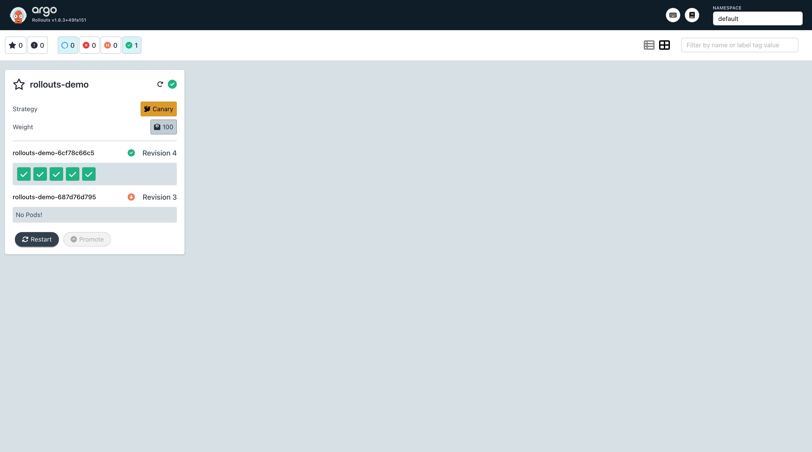
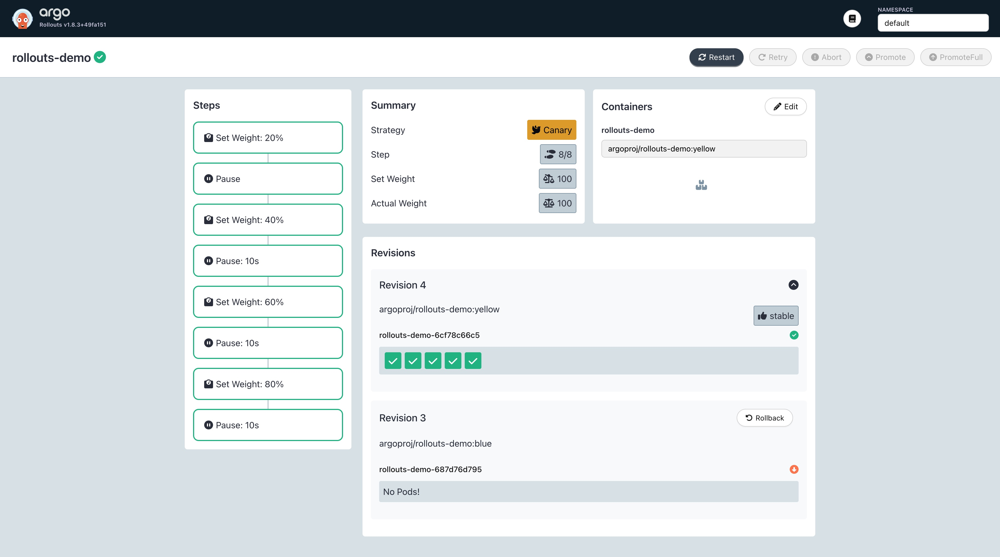

# 🚀 Argo Rollouts 快速开始指南

## 📋 目录

- [内容概要](#内容概要)
- [安装教程](#安装教程)
  - [标准安装方式](#标准安装方式)
  - [安装Kubectl插件](#安装kubectl插件)
  - [配置Shell智能补全](#配置shell智能补全)
- [Dashboard管控台](#dashboard管控台)
  - [安装Dashboard](#安装dashboard)
  - [暴露服务](#暴露服务)
  - [访问界面](#访问界面)
- [灰度部署实验](#灰度部署实验)

---

## 📝 内容概要

本指南将引导您完成以下步骤：

1. **📦 安装控制器** - 部署Argo Rollouts控制器（使用本目录下的`controller-install.yaml`文件）
2. **🔧 安装插件** - 安装Argo Rollouts kubectl插件
3. **⚡ 智能补全** - 配置shell自动补全功能
4. **🖥️ 管控台** - 部署并暴露Dashboard管控台服务
5. **🎯 灰度部署** - 实践金丝雀部署实验
6. **👀 效果体验** - 通过管控台查看灰度部署效果

---

## 🛠️ 安装教程

### 标准安装方式

#### 1. 创建命名空间并安装控制器

```shell
# 创建专用命名空间
kubectl create namespace argo-rollouts

# 安装Argo Rollouts控制器
kubectl apply -n argo-rollouts -f https://github.com/argoproj/argo-rollouts/releases/latest/download/install.yaml
```

> **💡 提示**: 上面的`install.yaml`对应当前目录下的`controller-install.yaml`文件，已手动下载并重命名。

#### 2. 验证安装结果

启动成功后，您应该看到类似以下输出：

```shell
$ kubectl get all -n argo-rollouts

NAME                                 READY   STATUS    RESTARTS       AGE
pod/argo-rollouts-64d959676c-4l8z9   1/1     Running   1 (122m ago)   3h47m

NAME                            TYPE        CLUSTER-IP       EXTERNAL-IP   PORT(S)    AGE
service/argo-rollouts-metrics   ClusterIP   10.104.154.157   <none>        8090/TCP   3h47m

NAME                            READY   UP-TO-DATE   AVAILABLE   AGE
deployment.apps/argo-rollouts   1/1     1            1           3h47m

NAME                                       DESIRED   CURRENT   READY   AGE
replicaset.apps/argo-rollouts-64d959676c   1         1         1       3h47m
```

---

### 🔧 安装Kubectl插件

#### 1. 下载插件

```shell
# 注意：请根据您的操作系统架构选择对应版本（amd64、arm64）
curl -LO https://github.com/argoproj/argo-rollouts/releases/latest/download/kubectl-argo-rollouts-darwin-amd64
```

#### 2. 设置可执行权限

```shell
chmod +x ./kubectl-argo-rollouts-darwin-amd64
```

#### 3. 移动到PATH目录

```shell
sudo mv ./kubectl-argo-rollouts-darwin-amd64 /usr/local/bin/kubectl-argo-rollouts
```

---

### ⚡ 配置Shell智能补全

```shell
# 创建自动补全脚本
cat <<EOF >kubectl_complete-argo-rollouts
#!/usr/bin/env sh

# Call the __complete command passing it all arguments
kubectl argo rollouts __complete "\$@"
EOF

# 设置可执行权限并移动到PATH
chmod +x kubectl_complete-argo-rollouts
sudo mv ./kubectl_complete-argo-rollouts /usr/local/bin/
```

---

## 🖥️ Dashboard管控台

### 安装Dashboard

```shell
# 安装Dashboard
kubectl apply -f dashboard-install.yaml
```

> **📎 资源下载**: [dashboard-install.yaml](https://github.com/argoproj/argo-rollouts/releases/download/v1.8.3/dashboard-install.yaml)

### 验证安装

启动成功后，您应该看到：

```shell
$ kubectl get all | grep rollout

pod/argo-rollouts-dashboard-7494df5486-7vcgj   1/1     Running   1 (131m ago)   171m
service/argo-rollouts-dashboard   ClusterIP   10.108.233.227   <none>        3100/TCP   3h19m
service/rollouts-demo             ClusterIP   10.100.38.38     <none>        80/TCP     3h29m
deployment.apps/argo-rollouts-dashboard   1/1     1            1           3h19m
```

### 暴露服务

```shell
# 使用端口转发暴露Dashboard服务
kubectl port-forward svc/argo-rollouts-dashboard 3100:3100 &
```

### 访问界面

打开浏览器，访问：

```url
http://localhost:3100
```

#### 🖼️ Dashboard界面预览





---

## 🎯 灰度部署实验

准备好开始您的金丝雀部署之旅了吗？

📚 **参考官方文档**: [Argo Rollouts Getting Started](https://argoproj.github.io/argo-rollouts/getting-started/)

---

## 📚 更多资源

- [官方文档](https://argoproj.github.io/argo-rollouts/)
- [GitHub仓库](https://github.com/argoproj/argo-rollouts)
- [示例配置](https://github.com/argoproj/argo-rollouts/tree/master/examples)

---

<div align="center">
  <p>🎉 祝您使用愉快！</p>
  <p>如有问题，请参考官方文档或提交Issue</p>
</div>
