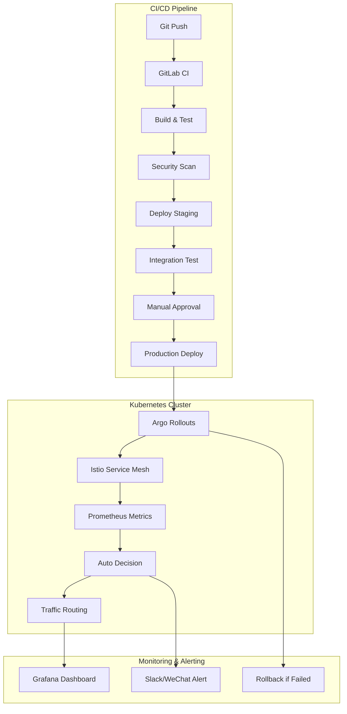

# 生产环境Istio部署策略最佳实践

> 解决手动维护策略文件的痛点，实现自动化、可靠的生产部署

## 🎯 核心问题与解决方案

### 传统问题
❌ **手动维护策略文件**：每次版本更新都需要修改YAML配置  
❌ **版本管理混乱**：不同版本的配置文件难以追踪  
❌ **人工错误风险**：手动操作容易出错  
❌ **回滚复杂**：需要手动恢复之前的配置  

### 现代化解决方案
✅ **模板化配置**：使用参数化模板自动生成配置  
✅ **GitOps工作流**：配置即代码，版本可追踪  
✅ **自动化流水线**：从代码提交到生产部署全自动  
✅ **智能分析**：基于指标自动决策部署进度  

## 🏗️ 架构设计

### 1. 技术栈选型



### 2. 核心组件

| 组件 | 作用 | 替代手动操作 |
|-----|------|-------------|
| **Argo Rollouts** | 渐进式交付控制器 | 手动修改VirtualService权重 |
| **GitOps** | 配置版本管理 | 手动维护多版本YAML文件 |
| **Prometheus** | 指标收集与分析 | 人工观察部署状态 |
| **模板引擎** | 动态生成配置 | 每次复制修改配置文件 |

## 🚀 实施步骤

### 步骤1：安装Argo Rollouts

```bash
# 安装Argo Rollouts控制器
kubectl create namespace argo-rollouts
kubectl apply -n argo-rollouts -f https://github.com/argoproj/argo-rollouts/releases/latest/download/install.yaml

# 安装CLI工具
curl -LO https://github.com/argoproj/argo-rollouts/releases/latest/download/kubectl-argo-rollouts-linux-amd64
chmod +x kubectl-argo-rollouts-linux-amd64
sudo mv kubectl-argo-rollouts-linux-amd64 /usr/local/bin/kubectl-argo-rollouts
```

### 步骤2：配置渐进式交付

参考项目中的 `istio/progressive-delivery.yaml` 文件，它包含：

- **Rollout资源**：定义部署策略和步骤
- **AnalysisTemplate**：基于Prometheus指标的自动分析
- **VirtualService/DestinationRule**：Istio流量路由配置

### 步骤3：集成CI/CD流水线

使用项目中的 `.gitlab-ci.yml` 配置，实现：

- **自动构建**：代码提交触发构建和测试
- **模板部署**：使用 `scripts/deploy-template.sh` 生成配置
- **自动化部署**：使用 `scripts/automated-deployment.sh` 执行部署

## 📊 部署策略对比

### 渐进式部署（推荐生产环境）

```yaml
# 自动化金丝雀步骤
steps:
- setWeight: 5    # 5%流量到新版本
- pause: {duration: 2m}
- setWeight: 10   # 根据指标分析决定是否继续
- pause: {duration: 2m}
- setWeight: 20
- pause: {duration: 5m}
# ... 自动推进到100%
```

**优势**：
- ✅ 风险最小：问题影响范围可控
- ✅ 自动回滚：指标异常时自动回滚
- ✅ 零停机：用户无感知升级
- ✅ 数据驱动：基于真实指标决策

### 紧急部署（生产故障时）

```bash
# 跳过分析，直接全量部署
./scripts/automated-deployment.sh user-service user-service:hotfix-v1.2.1 emergency
```

**使用场景**：
- 🚨 生产环境严重故障
- 🔒 安全漏洞紧急修复
- ⚡ 关键功能快速上线

### 蓝绿部署（大版本升级）

```bash
# 部署到Green环境，测试无误后一键切换
./scripts/deploy-template.sh user-service user-service:v2.0.0 v1.0.0 blue-green
```

**适用场景**：
- 📦 大版本升级
- 🔄 数据库schema变更
- 🧪 需要完整测试环境

## 🔧 生产环境配置示例

### 1. 服务更新流程

```bash
# 开发者只需要推送代码
git add .
git commit -m "feat: add new feature"
git push origin main

# CI/CD自动执行：
# 1. 构建镜像 -> user-service:v1.2.3
# 2. 安全扫描 -> 通过
# 3. 部署到staging -> 自动测试
# 4. 等待人工审批 -> 点击部署按钮
# 5. 生产环境渐进式部署 -> 自动完成
```

### 2. 指标监控配置

```yaml
# 成功率监控
successCondition: result[0] >= 0.99  # 成功率>99%
failureCondition: result[0] < 0.95   # 成功率<95%立即失败

# 延迟监控  
successCondition: result[0] <= 500   # P99延迟<500ms
failureCondition: result[0] > 1000   # P99延迟>1000ms立即失败
```

### 3. 自动化回滚策略

```yaml
# 检测到问题时自动回滚
analysis:
  successfulRunHistoryLimit: 5
  unsuccessfulRunHistoryLimit: 5
  templates:
  - templateName: success-rate
    args:
    - name: service-name
      value: user-service
```

## 📈 监控与告警

### 关键指标

| 指标类型 | 指标名称 | 阈值 | 影响 |
|---------|---------|------|------|
| **可用性** | 成功率 | >99% | 部署继续 |
| **性能** | P99延迟 | <500ms | 用户体验 |
| **容量** | CPU使用率 | <80% | 系统稳定性 |
| **错误** | 5xx错误率 | <1% | 功能可用性 |

### 告警配置

```yaml
# Prometheus告警规则
groups:
- name: istio-deployment
  rules:
  - alert: DeploymentHighErrorRate
    expr: |
      sum(rate(istio_requests_total{response_code=~"5.."}[5m])) /
      sum(rate(istio_requests_total[5m])) > 0.05
    for: 2m
    annotations:
      summary: "部署错误率过高，触发自动回滚"
```

## 🎛️ 常用操作命令

### 日常部署

```bash
# 1. 查看当前部署状态
kubectl argo rollouts get rollout user-service-rollout -n istio-demo

# 2. 部署新版本（渐进式）
./scripts/automated-deployment.sh user-service user-service:v1.2.3 progressive

# 3. 手动推进部署
kubectl argo rollouts promote user-service-rollout -n istio-demo

# 4. 暂停部署
kubectl argo rollouts pause user-service-rollout -n istio-demo

# 5. 中止并回滚
kubectl argo rollouts abort user-service-rollout -n istio-demo
```

### 故障处理

```bash
# 紧急回滚到上一个版本
./scripts/automated-deployment.sh user-service "" rollback

# 紧急部署修复版本
./scripts/automated-deployment.sh user-service user-service:hotfix emergency

# 查看部署历史
kubectl argo rollouts history rollout user-service-rollout -n istio-demo

# 查看实时指标
kubectl argo rollouts get rollout user-service-rollout -n istio-demo --watch
```

## 🔐 安全最佳实践

### 1. 权限控制

```yaml
# RBAC配置示例
apiVersion: rbac.authorization.k8s.io/v1
kind: Role
metadata:
  name: deployment-operator
rules:
- apiGroups: ["argoproj.io"]
  resources: ["rollouts"]
  verbs: ["get", "list", "update", "patch"]
- apiGroups: ["networking.istio.io"]
  resources: ["virtualservices", "destinationrules"]
  verbs: ["get", "list", "update"]
```

### 2. 镜像安全

```bash
# CI/CD中集成安全扫描
trivy image --exit-code 1 --severity HIGH,CRITICAL user-service:v1.2.3
```

### 3. 网络策略

```yaml
# 限制网络访问
apiVersion: networking.k8s.io/v1
kind: NetworkPolicy
metadata:
  name: user-service-netpol
spec:
  podSelector:
    matchLabels:
      app: user-service
  policyTypes:
  - Ingress
  - Egress
  ingress:
  - from:
    - podSelector:
        matchLabels:
          app: gateway
```

## 📚 相关资源

### 官方文档
- [Argo Rollouts文档](https://argoproj.github.io/argo-rollouts/)
- [Istio流量管理](https://istio.io/latest/docs/concepts/traffic-management/)
- [Prometheus指标查询](https://prometheus.io/docs/prometheus/latest/querying/basics/)

### 项目文件
- `istio/progressive-delivery.yaml` - 渐进式交付配置
- `scripts/automated-deployment.sh` - 自动化部署脚本
- `scripts/deploy-template.sh` - 模板化配置生成
- `.gitlab-ci.yml` - CI/CD流水线配置

## 🚀 快速开始

1. **克隆项目并安装依赖**
   ```bash
   git clone <your-repo>
   cd istio-project
   chmod +x scripts/*.sh
   ```

2. **部署Argo Rollouts**
   ```bash
   kubectl apply -f istio/progressive-delivery.yaml
   ```

3. **执行第一次部署**
   ```bash
   ./scripts/automated-deployment.sh user-service user-service:v1.0.0 progressive
   ```

4. **监控部署进度**
   ```bash
   kubectl argo rollouts get rollout user-service-rollout -n istio-demo --watch
   ```

## 💡 总结

通过采用现代化的GitOps + Argo Rollouts + Istio架构，我们彻底解决了手动维护策略文件的问题：

✅ **自动化程度高**：从代码提交到生产部署全自动  
✅ **风险可控**：渐进式发布，问题及时发现和回滚  
✅ **操作简单**：开发者只需关注代码，部署策略由平台处理  
✅ **可观测性强**：完整的指标监控和告警体系  
✅ **扩展性好**：模板化配置支持任意服务和策略  

这种方式不仅提高了部署效率，更重要的是大大降低了生产环境的运维风险，让团队可以更专注于业务功能的开发。 